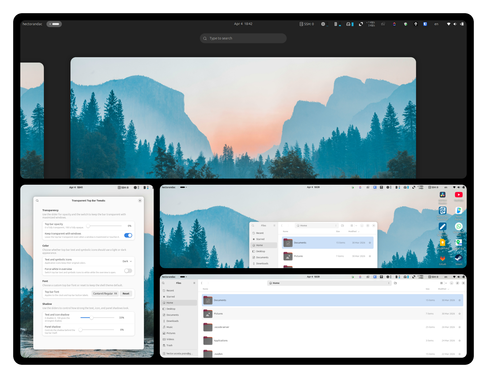

# Transparent Top Bar Tweaks

Transparent Top Bar Tweaks is a configurable GNOME Shell extension that restores a transparent panel and gives users direct control over how the top bar looks and behaves.

It is designed for people who want a cleaner desktop without giving up legibility. Instead of a fixed transparent bar, the extension exposes practical appearance controls for opacity, typography, symbolic icon color, overview behavior, and shadows from a native preferences window.



## Why This Extension

GNOME Shell once included transparent top bar behavior by default. This project builds on that idea and turns it into a modern, configurable extension that feels intentional rather than theme-dependent.

The goal is simple:

- keep the top bar visually light
- preserve readability over different wallpapers and window states
- make customization accessible from settings instead of manual CSS edits

## Highlights

- Adjustable top bar opacity from `0` to `100`
- Optional transparency even when windows are maximized or touching the panel
- Light or dark mode for top bar text and symbolic icons
- Optional white override for overview mode
- Custom top bar font selection
- Adjustable text and icon shadow strength
- Adjustable panel shadow strength
- Smooth transitions for overview and content color changes

Full-color application icons are intentionally left unchanged.

## Preferences

The preferences window is organized around the controls people actually use:

- `Transparency`
  Opacity and window-behavior controls for the panel background
- `Color`
  Light or dark symbolic content, plus overview-specific white mode
- `Font`
  A native font picker for top bar labels such as the clock
- `Shadow`
  Strength sliders for content and panel depth

## Compatibility

The extension metadata currently targets GNOME Shell `46` through `50`.

## Installation

### From Extensions.gnome.org

Once published, install it directly from Extensions or Extension Manager.

### From Source

Build the extension bundle:

```bash
make build
```

Install it into the local user extension directory:

```bash
make install
```

On X11, reload GNOME Shell after JavaScript runtime changes:

1. Press `Alt+F2`
2. Type `r`
3. Press `Enter`

## Project Structure

- `src/extension.js` contains the runtime behavior and generated panel styling
- `src/prefs.js` provides the preferences UI
- `src/schemas/org.gnome.shell.extensions.transparent-top-bar-tweaks.gschema.xml` defines the settings schema
- `Makefile` builds the release zip and installs the extension locally

## Attribution

This fork builds on the original Transparent Top Bar extension and the GNOME Shell feature work that inspired it:

- GNOME Shell merge request that originally implemented transparent top bar behavior:
  <https://gitlab.gnome.org/GNOME/gnome-shell/merge_requests/376/>
- Original extension project:
  <https://github.com/zhanghai/gnome-shell-extension-transparent-top-bar>

## License

This project is distributed under the terms of the GNU General Public License, version 2 or later.
